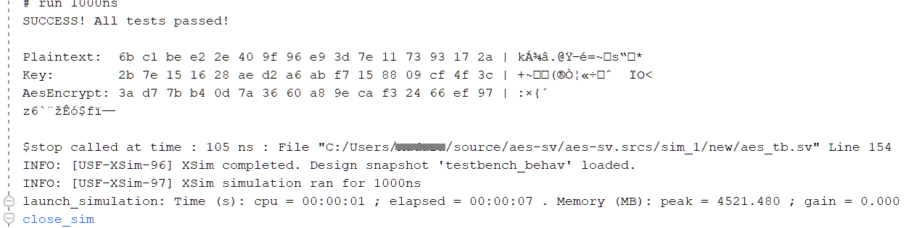

# AES128 
AES is a symmetric encryption algorithm established by U.S. National Institute of Standards and Technology (NIST) in 2001, used for storing data securely at rest and in transit.

- AES 128 (ECB mode) in SystemVerilog
- Built in Xilinx Vivado 2023
- Synthesis: 425 cells, 288 I/O ports, 856 nets
- SVA based verification test - verifying expandedkey, and AES blocks returned

Encryption success against an AES test from NIST document SP800-38A

`AES-128-ECB : 2B7E151628AED2A6ABF7158809CF4F3C :: 6BC1BEE22E409F96E93D7E117393172A : 3AD77BB40D7A3660A89ECAF32466EF97`

#### Future work
Convert steps to state machine
